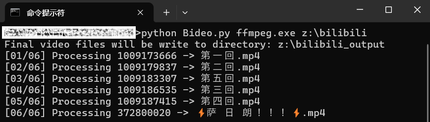

## Bideo

**Bideo** is a simple Python script that can extract all the videos from Bilibili client's local cache directory.

**Bideo** is fast, secure, and free.

## Usage

```bat
Bideo.py <ffmpeg path> <bilibili cache directory>
```

The extracted videos files will be saved in directory `<bilibili cache directory>_output`.

Blog post in Chinese: [使用 FFmpeg 从 Bilibili 缓存目录提取视频文件](https://secdroid.github.io/2024/12/01/extract-video-from-bilibili-cache-with-ffmpeg/)

## Screenshots



